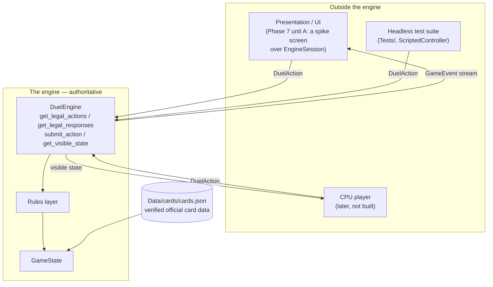
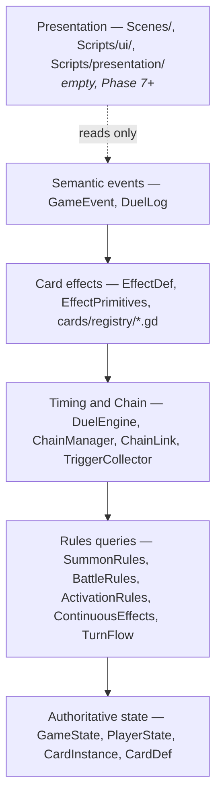
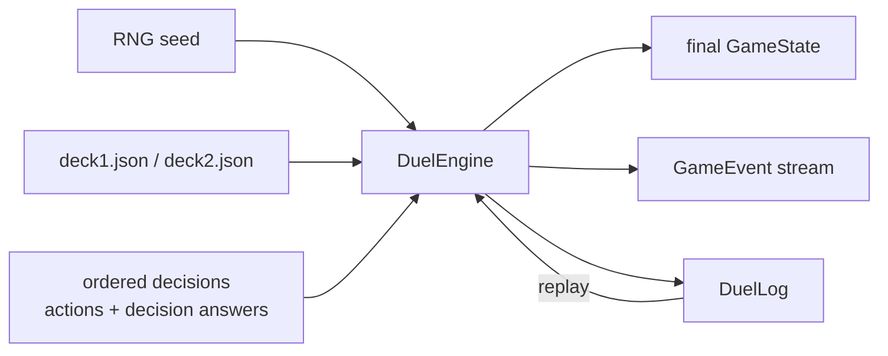
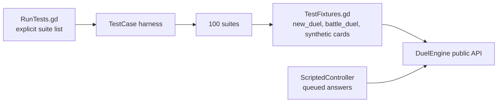
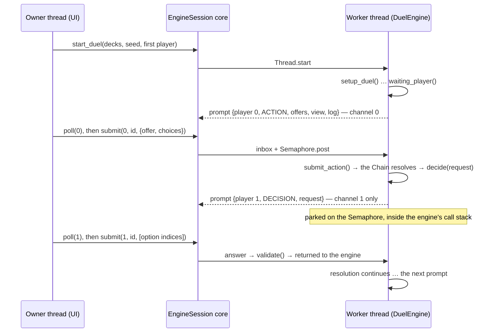

# Architecture

How Duel Arena is put together, and why. This document describes the code that exists today.
Where something is planned but not built, it says so explicitly.

See [`../README.md`](../README.md) for the project overview and current status, and
[`TESTING.md`](TESTING.md) for the test architecture in detail.

---

## Contents

- [The one rule everything follows](#the-one-rule-everything-follows)
- [System boundaries](#system-boundaries)
- [Engine layers](#engine-layers)
- [State ownership](#state-ownership)
- [The public API](#the-public-api)
- [Chain and timing architecture](#chain-and-timing-architecture)
- [Card effects](#card-effects)
- [Rules queries](#rules-queries)
- [The event system](#the-event-system)
- [Deterministic replay](#deterministic-replay)
- [Hidden information](#hidden-information)
- [Test architecture](#test-architecture)
- [The UI execution boundary (ADR-0001)](#the-ui-execution-boundary-adr-0001)
- [The presentation boundary](#the-presentation-boundary)
- [The future CPU boundary](#the-future-cpu-boundary)
- [Decisions worth knowing about](#decisions-worth-knowing-about)

---

## The one rule everything follows

> **The engine is authoritative. Nothing outside it decides what is legal, and nothing outside
> it mutates state.**

Every architectural choice below follows from that. The engine is a set of plain
`RefCounted` GDScript classes — **no `Node`, no scene tree, no signals into a UI, no `await`,
no frame dependency**. It can be driven to completion inside a single function call, which is
what makes a 10,607-assertion headless suite practical and what will keep a future UI from
being able to corrupt a duel.

---

## System boundaries



Three consumers, one door. The test suite is a first-class consumer and uses exactly the same
API a UI will — which is why the engine is known to be drivable before any UI exists.

Everything crossing the boundary is structured data:

| Direction | Type | Notes |
|---|---|---|
| in | `DuelAction` | Re-validated on submit. A hand-built action cannot bypass the rules. |
| in | decision answers | Validated against the offered options; an illegal answer is a hard error. |
| out | `GameEvent` | A statement that something **already happened**. Consuming one cannot change an outcome. |
| out | visible state | Filtered per viewer. A consumer is never handed information its player should not have. |

---

## Engine layers

Each layer knows only about the ones below it.



| Layer | Directory | Rule |
|---|---|---|
| State | `Scripts/engine/` | Owns all mutation. Knows nothing about cards, timing or effects. |
| Rules queries | `Scripts/rules/` | Answers "is this legal?" and performs rule-driven mutation through the state layer. Knows nothing about specific cards. |
| Timing and Chain | `Scripts/engine/DuelEngine.gd`, `Scripts/rules/Chain*.gd` | Owns *when* things may happen. Knows about effects generically, never by name. |
| Card effects | `Scripts/cards/` | Declares what individual cards do, composed from shared primitives. |
| Events | `Scripts/engine/GameEvent.gd`, `DuelLog.gd` | Describes what happened. |
| Presentation | `Scenes/`, `Scripts/ui/`, `Scripts/presentation/` | **Not built.** Will consume events and submit actions. |

**No card file may reach past the effect layer** to mutate state directly. Cards compose
primitives; primitives call the rules and state layers.

---

## State ownership

`GameState` is the single source of truth. There is deliberately no second, looser path into
mutation.

| Owner | Owns |
|---|---|
| `GameState` | Turn number, turn player, phase, battle step, damage sub-step, the RNG, the event log, control leases, banish leases, counters, per-turn flags, and the `PlayerState` for each player. |
| `PlayerState` | That player's zones — hand, Deck, Graveyard, banished, Monster Zones, Spell/Trap Zones, Field Zone, Extra Deck, Extra Monster Zone, excavated — plus LP and per-player turn state such as `battle_phase_skips`. |
| `CardDef` | The **immutable, shared** identity of a card: name, passcode, category, printed stats, official text, Spell Speed. One instance per card name, shared by every copy. **Never written to.** |
| `CardInstance` | One runtime copy: id, controller, owner, zone, zone index, position, face-up/face-down, modified stats, attached counters, per-card persistent facts, and any acquired `monster_identity`. |

### Two invariants that carry a lot of weight

**1. All card movement goes through `GameState.move_card()` with an explicit
`Enums.MoveReason`.**

This is what makes "destroyed" distinguishable from "returned to hand", "Tributed", "sent to
the GY as a cost", "banished" and "added to hand". Card effects genuinely depend on the
difference — the rulebook's own glossary distinguishes them — so the reason is authoritative
state, not a display label. Centralising movement also gives the engine exactly one place to
hang cross-cutting rules: it is where a Trap Monster's borrowed identity is revoked on every
departure from a Monster Zone, deliberately **not** inside `on_leave_field()`, which never runs
on the negated-Summon path.

**2. `CardDef` is never mutated.**

Every copy of a card on the field points at the same `CardDef`. A Trap Monster gaining a
monster identity, a monster gaining ATK, a card being negated — all of that lives on the
`CardInstance`. Writing to `CardDef` would silently change every other copy in the duel,
including the ones in the opponent's Deck.

### Leases: temporary state with an explicit end

Several mechanics grant something *until* some future moment. Rather than scattering
"remember to undo this" logic, the engine models each as a **lease** held by `GameState`, with
an explicit duration enum and a single expiry point:

| Lease | Duration type | Ends |
|---|---|---|
| Control lease | `Enums.ControlDuration` | End Phase, or when the source leaves |
| Banish lease | `Enums.BanishDuration` | The stated return timing |
| Battle Phase skip | `PlayerState.battle_phase_skips` | Consumed by `TurnFlow` on the next Battle Phase |

A lease is data, inspectable and testable, and its expiry is one code path rather than one per
card.

---

## The public API

Four calls on `DuelEngine` are the entire surface:

| Call | Returns | Meaning |
|---|---|---|
| `get_legal_actions(pid)` | `Array[DuelAction]` | What the turn player may do in an open game state. **Returns nothing unless the engine is open *and* `pid` is the turn player.** |
| `get_legal_responses(pid)` | `Array[DuelAction]` | What `pid` may activate in a response window. |
| `submit_action(action)` | `bool` | Submit one action, **re-validated on submit**. |
| `get_visible_state(viewer_id)` | `Dictionary` | The board as that player is allowed to see it. |

Plus `get_pending_decision()` / a `PlayerController` answering it, `get_public_log()`,
`is_duel_over()` and `waiting_player()`.

The re-validation on submit is not redundant. It means a consumer that builds a `DuelAction`
by hand — a buggy UI, a malicious client, a test doing something unusual — cannot get an
illegal action executed. **Legality is asserted twice and enforced in the engine.**

### The headless backend contract

Nothing in the engine, rules or card code needs the Godot scene tree: every type is a
`RefCounted`, and `BackendAcceptanceTests` scans that code for `get_tree()`, `extends Node`,
`await`, the clock and unseeded randomness and requires none. A backend drives a whole duel with:

1. `CardRegistry.load_library()` → the 77 `CardDef`s with their effects attached (read-only,
   shareable across duels);
2. `DuelEngine.new(seed)` then `setup_duel([deck0, deck1], [controller0, controller1],
   first_player, deck_names)` — each deck an ordered `Array[CardDef]`, each controller a
   `PlayerController` that answers `decide(DecisionRequest)`;
3. a loop: `waiting_player()` → `get_legal_actions(pid)` in an open game state or
   `get_legal_responses(pid)` in a window → `submit_action(one of them)`, until
   `is_duel_over()`. `waiting_player() == -1` while the duel is not over never happens in a
   correct engine; `DuelDriver` fails loudly on it;
4. per player, only `get_visible_state(pid)` and `state.get_log_for(pid)` — never the raw state;
5. `log.to_json()` to store the duel, `DuelLog.payload_from_json(text)` to read it back.

`Tests/support/DuelDriver.gd` is the reference client: it plays whole duels between the two real
decks through exactly this contract, and is what `ScriptedDuelTests` and
`BackendAcceptanceTests` are built on.

**Lifetime.** A duel's objects are freed when the last outside reference to its `DuelEngine` is
dropped. Every subsystem holds the `GameState`; the one back-pointer to the engine
(`ChainManager.engine`) is a `WeakRef`, because a strong one made a cycle that kept every duel
alive — ~187 ObjectDB instances per duel until the post-card phase fixed it. `LifetimeTests`
asserts that a dropped duel frees everything and that ObjectDB does not grow per duel.

---

## Chain and timing architecture

The timing system is a transcription of the official Fast Effect Timing chart (source S2),
not an invention. `DuelEngine.Timing` maps one-to-one onto the chart's boxes, and
`RULES_SPEC.md §3` carries the transcription.

```mermaid
stateDiagram-v2
    [*] --> OPEN
    OPEN: box A — open game state, turn player acts
    FAST_TURN: box B — turn player may activate a fast effect
    FAST_OPP: box C — opponent may activate a fast effect
    CHAIN_BUILD: box D — alternate responses until two consecutive passes
    TP_PASSED: box E — turn player passed; opponent may respond before the phase moves

    OPEN --> FAST_TURN: an action or trigger opens a window
    FAST_TURN --> FAST_OPP: turn player passes
    FAST_OPP --> CHAIN_BUILD: someone activates
    FAST_TURN --> CHAIN_BUILD: turn player activates
    CHAIN_BUILD --> CHAIN_BUILD: a response is added
    CHAIN_BUILD --> OPEN: two consecutive passes, chain resolves in reverse
    FAST_OPP --> OPEN: both pass
    OPEN --> TP_PASSED: turn player asks to change phase or step
    TP_PASSED --> OPEN: opponent responds or passes
```



### How a Chain is built and resolved

1. An activation becomes **Chain Link 1**. Its **costs are paid and its targets are fixed at
   activation time** and stored on the `ChainLink`.
2. Each response becomes the next link. To respond, an effect must be **Spell Speed ≥ 2 and
   ≥ the previous link's Spell Speed** — the rule from S1 p.44, enforced in one place.
3. **Two consecutive passes** close the Chain.
4. Links resolve in **reverse order**. At resolution, the link reads back its stored targets
   and **re-checks them**: still on the field, and — where the clause says "your opponent's" or
   the general targeting rule applies — still under the expected control. A target that no
   longer qualifies is dropped.
5. `ChainManager` **fails loudly** if a chain-starting effect has no `resolve()`. There are no
   placeholder effects.

`ChainLink` also stores its **1-based position**, because that is authoritative state rather
than a display value: cards in this pool read the Chain Link number at resolution.

### Triggers

`TriggerCollector` gathers effects whose trigger conditions have been met and orders them by
the official simultaneous-activation rule (S1 p.51): the turn player's mandatory effects, then
the opponent's mandatory, then the turn player's optional, then the opponent's optional.

Critically, **the trigger path and the player-facing path funnel through the same
`ActivationRules.can_activate()`**. A Trigger Effect and a hand-activated Spell are judged by
identical rules. There is deliberately no second, looser path — that is the kind of divergence
that produces bugs nobody can reproduce.

### One thing that surprises newcomers

**The engine does not pause when nobody holds a legal response.** It auto-passes and resolves
the whole attack, chain or Damage Step inside a single `submit_action()`. To observe an
intermediate state you read the event log, or give a player a genuine fast effect so a window
actually opens.

---

## Card effects

A card is a **declaration**, not a script.

```
Scripts/cards/registry/<CardName>.gd
    const CARD_NAME := "..."
    func effects() -> Array        # one EffectDef per official clause
        └── EffectDef
              ├── declarative fields   type, spell speed, locations, triggers,
              │                        phases, damage-step permission, targeting,
              │                        once-per-turn kind, negation, restriction group
              └── Callables            condition, can_pay_cost, pay_cost,
                                       legal_targets, targets_valid, resolve,
                                       apply_continuous, respond_to_event,
                                       destruction_substitute
                     └── composed from EffectPrimitives.gd
```

`EffectContext` is what those callables receive: the state, the controller id, the chain link,
and the cost payload recorded at activation.

### Loading

`CardRegistry` **scans** `Scripts/cards/registry/` rather than reading a hand-written list.
This is deliberate: a list can drift from reality, a scan cannot. The registry then validates
each file and attaches its effects to the canonical `CardDef` loaded from `cards.json`.

Registry files carry **no `class_name`** — 77 of them would pollute Godot's global class list,
and the loader works by path.

### Costs are not effects

The engine keeps `can_pay_cost` / `pay_cost` strictly separate from `resolve`. A cost is paid
at activation, is not part of the effect, and cannot be negated as one. The cost payload is
recorded into both the `COST_PAID` event and the `ChainLink`, so a clause can read at
resolution what was actually paid — which is how "paid LP" became a property of an
*activation* rather than of an LP delta, with no engine change required to carry it.

### Continuous effects are recomputed, not undone

`ContinuousEffects` derives its results from the current board every time the state could have
changed. Nothing "undoes" a continuous effect: when its source leaves the field, is flipped
face-down, or is negated, the next recompute simply does not produce it. This removes an entire
category of bug — the cleanup step that forgets a case.

A consequence worth knowing when writing tests: **continuous effects are recomputed at engine
timing points, not when a test arranges the board.** A baseline assertion taken straight after
placing cards reads the un-recomputed value.

---

## Rules queries

| Module | Owns |
|---|---|
| `SummonRules` | Normal Summon, Normal Set, Tribute Summon/Set, Flip Summon, Special Summon, summoning procedures — and the **two-step declaration** that makes a Summon negatable. |
| `BattleRules` | Battle Phase steps, attack declaration, attack replay, and the **five-sub-step Damage Step** with its activation restriction. |
| `ActivationRules` | Whether any effect may activate, from any path. |
| `ContinuousEffects` | State-derived effects, restrictions and continuous negation. |
| `TurnFlow` | Phase progression, including consuming a pending Battle Phase skip. |

### Why a Summon is two steps

A Summon is a **declaration** first, and only then a success. That is what makes it possible
to respond to and negate one — including a Flip Summon, which the engine treats as a Summon
for negation purposes. The intermediate state is real (`GameState.pending_summon_card_id`),
which is what lets `negate_pending_summon()` exist at all. A one-step "the monster is now on
the field" model cannot express summon negation without special-casing it afterwards.

### The Damage Step is five sub-steps

Not one comparison. `Enums.DamageSubStep` names each, and the restriction on what may activate
inside the Damage Step — only Counter Traps, or effects that directly change ATK/DEF, and only
up until the start of damage calculation — is enforced against
`EffectDef.damage_step_permission` rather than being approximated.

---

## The event system

`GameEvent` is the engine's outward vocabulary: **57 kinds**, each one a semantic statement
about something that **already happened** in authoritative state.

The distinctions in the vocabulary are the point. The engine emits different events for
things a naive model would merge:

| Kept apart | Why |
|---|---|
| `CARD_RETURNED_TO_HAND` vs `CARD_ADDED_TO_HAND` | "Return" and "add to your hand" are different actions with different triggers. |
| `CARD_RETURNED_FROM_BANISHMENT` vs any Summon event | A temporarily banished monster **comes back but is not Summoned**. |
| `NORMAL_SUMMON_DECLARED` vs `NORMAL_SUMMON_SUCCEEDED` | The gap between them is where negation lives. |
| `EFFECT_NEGATED` vs `ACTIVATION_NEGATED` vs `SUMMON_NEGATED` vs `ATTACK_NEGATED` | Four different rules with four different consequences. |
| `BATTLE_PHASE_SKIP_IMPOSED` vs `BATTLE_PHASE_SKIPPED` | They happen on different turns. |

Because an event describes the past, **a consumer cannot change a rules outcome by handling
one**. That is the structural reason presentation can be added later without endangering
correctness.

`CARD_REVEALED` carries the viewers it was revealed to, and is public only when both players
saw it — the event stream respects hidden information rather than leaking it.

---

## Deterministic replay

A duel is a pure function of `(decks, RNG seed, the ordered list of player decisions)`.



* `Rng` is **explicitly seeded and never reseeded from the system clock**.
* Nothing in the engine reads the clock, the frame counter or unseeded randomness.
* `DuelLog` records the seed plus every submitted action and decision answer, in order.
* `ReplayTests` proves a recorded duel replays to an identical state.
* `ScriptedDuelTests` and `BackendAcceptanceTests` prove it for **whole games** between the real
  decks: every scripted duel is rebuilt from its payload alone and must reproduce every event and
  the final board. The payload also survives being stored as JSON — through
  `DuelLog.payload_from_json()`, which restores the ints JSON turns into floats (without it a
  recorded answer `[12]` comes back as `[12.0]` and no longer matches the option `12`; the test's
  control proves the raw parse diverges).
* `Tools/check_determinism.*` plays the scripted duels in **two separate processes** and requires
  byte-identical digests of their event streams, boards and payloads.

This is a debugging tool before it is a feature. A wrong rules interaction becomes a
**reproducible artefact** rather than an anecdote — re-run the seed and the decision list and
you get the same duel on any machine. Several suites deliberately run a scenario twice and
assert identical results, so a non-deterministic regression fails immediately instead of
becoming a flaky test.

---

## Hidden information

`get_visible_state(viewer_id)` filters state per viewer rather than handing out the whole
board. Implemented: per-viewer hand/Deck/face-down visibility, `revealed_to` tracking so a
reveal is recorded *to a specific player*, shuffling clearing known Deck information, and known
top/bottom placement surviving where it should.

The **event stream** is filtered too: an event is public unless it carries `private_to`, and
`get_log_for(pid)` returns only what `pid` may read. A move event names its card only to the
players who could see that card at one end of the move (`RULES_SPEC.md` §12.5) — the rule the
first full scripted duel forced, because a Set card was being named in the opponent's log by the
`CARD_MOVED` emitted just before the private `CARD_SET`. `DuelDriver` checks both the view and
every move event, from both sides, after every step of every scripted duel.

**The pass-and-play privacy UI is Phase 9 and does not exist.** The engine-side model exists so
that UI will have correct data to render — nothing more is claimed.

---

## Test architecture

The suite drives the engine through the **same public API** a UI will, using
`ScriptedController` — a `PlayerController` that answers from an explicit queue.



Structural guards, each of which exists because of a real incident or a real risk:

* **A zero-assertion suite is a failure.** Otherwise a suite that fails to compile reports
  "0/0 passed" and the run claims PASS while testing nothing. This happened once.
* **Suites are registered explicitly**, so one that fails to load is a hard error, not a
  silently skipped file.
* **A `--check-only` parse pass runs first**, because a suite that fails to compile makes
  `_initialize()` throw before it can call `quit()`, hanging the headless `SceneTree` forever.
* **The engine's loud failures are themselves asserted** — `ChainManager` on a missing
  `resolve()`, `ContinuousEffects` on an unknown restriction flag.

**Mechanic gates** are the organising idea: a generic suite for a whole mechanic, built from
synthetic cards and passing *before* the first real card needs it. See
[`TESTING.md`](TESTING.md).

---

## The UI execution boundary (ADR-0001)

**Status: ACCEPTED — Phase 7 unit A, 2026-09-10.** Proven by `EngineSessionTests` (174
assertions, in the full run) and `SceneSpikeCheck` (the project's main scene driven through a real
main loop). **No engine, rules or card code changed.**

**Context.** The engine asks two kinds of question, and they reach a player differently:

* **timing-window questions are pulled** — `waiting_player()`, `get_pending_decision()`,
  `get_legal_actions()` / `get_legal_responses()` and `submit_action()` drive open game states and
  response windows;
* **mid-resolution questions are pushed, synchronously** — trigger targets, optional-trigger
  yes/no, trigger order and every choice a card makes while it resolves arrive as a
  `DecisionRequest` through `PlayerController.decide()`, called from inside the engine's own stack
  (`DuelEngine._choose_targets_for()`, `TriggerCollector`, `TurnFlow`, and `EffectContext.ask_player()`
  under `ChainManager.resolve_chain()`).

A Godot UI cannot answer from inside that call on its main thread: blocking it freezes the window,
and `await` in the engine would break the headless contract above.

**Decision — a worker-thread session adapter** (`Scripts/session/`):

* `EngineSession` (a `RefCounted`) owns one `DuelEngine` and runs it on **one dedicated `Thread`**.
  The thread that created it — the *owner*, a UI's main thread — only calls `start_duel()`,
  `poll(viewer)`, `submit(player, prompt_id, value)` and `stop()`.
* `HumanController` is a `PlayerController` whose `decide()` hands the request to the session and
  blocks on a `Semaphore` until the owner answers or the session stops.
* **Exactly one prompt is open at a time**, because the engine is single-threaded: an `ACTION` or
  `RESPONSE` prompt from `get_pending_decision()`, or a `DECISION` prompt from `decide()`. The
  worker publishes it and parks.
* **The UI pulls.** Nothing in `Scripts/session/` emits a signal, defers a call or touches the scene
  tree; every message is a plain-data deep copy; answers are **indices** (an offer index plus choice
  fields, or option indices), never engine values. The engine still re-validates every action, and
  every decision answer goes through the engine's own `DecisionRequest.validate()`.
* Replay and determinism are untouched: `DuelLog` records every answer exactly as it does for any
  controller. The six scripted real-deck duels played through the session reproduce the
  single-threaded `DuelDriver` run **event for event, board for board, payload for payload**.



**Thread discipline, enforced in one class.** Every owner API checks the calling thread and
refuses (and counts) any other; every engine event is emitted on the worker (asserted); the worker
cannot do UI work because the code it runs has no way to (scanned); `debug_engine()`, for tests
only, returns the engine only while the worker is parked. **Cancellation:** `stop()` releases a
worker blocked mid-resolution with structurally valid neutral answers so the engine's stack
unwinds, then joins the thread. Dropping the last reference joins it too (inlined in
`_notification`, because a method called on `self` during `PREDELETE` fails with "null
instance"). Repeated sessions — stopped mid-resolution, stopped idle, or simply dropped — leave
ObjectDB growth at **0**.

**The privacy rule — by construction.** A player's channel advances **only at that player's own
prompts and at the end of the duel.** Prompt ids are numbered per player; the view is taken at the
player's own prompt; the log is projected per viewer. So whether, when or how often the OTHER
player was asked anything cannot change what arrives. The projection removes one thing the raw
engine log leaks: the engine stops in a response window only for a player who has a legal response
and passes automatically otherwise, and a manual pass (`{"player", "timing"}`), an automatic one
(`{"player", "automatic": true}`) and a skipped FAST / TP window (no event at all) all look
different — so the raw `get_log_for()` tells the opponent whether a player *could* have responded.
The projection drops the other player's `RESPONSE_PASSED` and every event's `sequence`. Proven:
player 0's channel is byte-identical whether the opponent declined a mid-resolution decision or
was never asked (`Fairy Tail - Luna`), and whether the opponent had response windows or none —
while the raw log is shown to differ in the second case.

**Consequences and limits.**

* A channel shows nothing between its own prompts; what the opponent did arrives as the log delta
  at the viewer's next prompt or at the end. Any future progress stream must pass the same
  channel-equality tests before a UI uses it.
* The session does not make a **shared screen** safe. On one monitor, showing the other player's
  prompt reveals that they were asked; the pass-and-play handoff policy is Phase 7 unit E.
* **Found, not fixed here:** a hidden card's stub in `get_visible_state()` still carries its
  instance `id`, and ids are assigned in pre-shuffle Deck-list order — the Deck list is public, so
  the id identifies the card (measured: 15 of 15 hidden hand cards identified over three seeds).
  This is an engine-level hidden-information leak older than Phase 7; it is gated as the first
  item of unit B.

**Rejected.** A *resumable engine* (a pending decision as engine state) is not needed — the spike
succeeded without touching the Chain paths every assertion sits on. *`await` in the engine*
breaks the headless backend contract.

---

## The presentation boundary

**Partly built — Phase 7 unit A.** `Scenes/ui/DuelSpike.tscn` is `run/main_scene`: a deliberately
thin developer screen (the open prompt as text, the offers and answers as buttons, a short log)
that talks to `EngineSession` and nothing else. The real board is unit B.

The contract it honours, now through `EngineSession`:

1. presentation **reads** the messages of its viewer's channel — the viewer-filtered state and the
   projected event log;
2. presentation **renders** the offers and options exactly as the engine listed them;
3. presentation **submits** an offer index and choices, or option indices, which the engine
   re-validates;
4. presentation **never** computes legality, never mutates state, and never derives a rules
   outcome from anything other than an event the engine emitted.

Because events describe the past and actions are re-validated, a presentation bug can produce
a wrong *picture* but not a wrong *duel*.

---

## The future CPU boundary

**Not built.** But it needs no new engine surface, which was the point of building the API
this way.

A CPU player is a `PlayerController` that:

* reads `get_visible_state(pid)` — and therefore **cannot cheat by construction**, because it
  is handed the same filtered view a human gets;
* chooses from `get_legal_actions(pid)` / `get_legal_responses(pid)`;
* answers `DecisionRequest`s.

`ScriptedController` already proves the shape works: the test suite is, in effect, a very
opinionated CPU player driving 10,607 assertions through this exact interface.

---

## Decisions worth knowing about

Recorded so they are not silently reversed.

| Decision | Why |
|---|---|
| The engine uses plain `RefCounted`, not `Node` | Headless testability, no frame dependency, no scene tree. |
| Registry files have no `class_name` | 77 global classes would pollute the class list; the loader works by path. |
| `CardRegistry` scans rather than lists | A hand-written list can drift from the matrix; a scan cannot. |
| Vanilla Normal Monsters have no registry file | They have no effects; they are counted from the card database's `is_normal` flag. |
| Counts are computed by `Tools/build_matrix.py` | Reading the code means the matrix cannot over-report. |
| A card is only TESTED if it has its own suite | Interaction suites declare no card marker, so they cannot inflate the count. |
| Movement carries an explicit `MoveReason` | "Destroyed" must be distinguishable from "returned", "Tributed", "sent as a cost". |
| Trap Monster identity lives on `CardInstance` | The shared `CardDef` must never be written to. |
| Identity is revoked in `move_card()`, not `on_leave_field()` | `on_leave_field()` never runs on the negated-Summon path. |
| Extra Deck and Extra Monster Zone exist in the model but are unused | So they can be enabled later without a state migration. |
| `restriction_group` and the negation events are separate concepts | Attack prevention, attack negation and a card-class activation lock are three different things and must never become one boolean. |
| Ambiguous rulings are isolated behind a single predicate | So a later correction is a one-place change that fails loudly. |
| The engine runs on a worker thread behind `EngineSession` (ADR-0001) | Mid-resolution decisions are synchronous calls inside the engine; a UI cannot answer them on its main thread, and a resumable engine would rewrite the Chain paths every assertion sits on. |
| A session channel advances only at its own player's prompts | Otherwise the count, ids, views or log of one channel would reveal whether the other player was asked something — or could have responded. |
